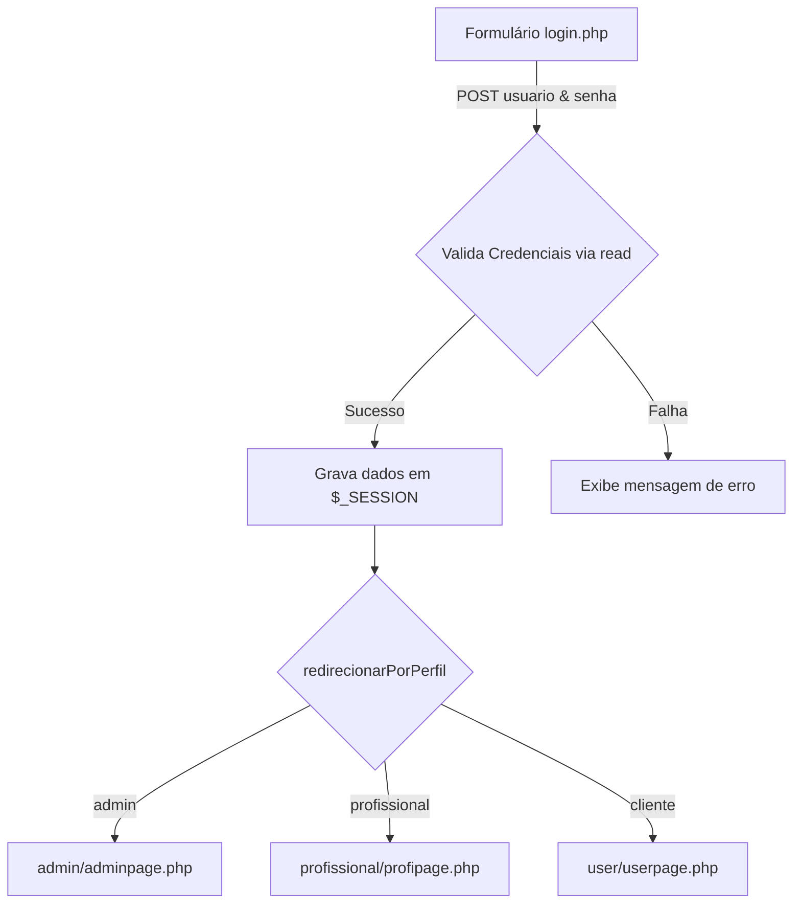

# Documentação Técnica do Sistema SYNC

Esta documentação apresenta a análise detalhada da arquitetura, estrutura de arquivos, funcionamento do back-end, padrões de persistência e nível de complexidade do sistema **SYNC**, exatamente como se encontra implementado no repositório atual.

O objetivo deste documento é servir como **referência técnica de arquitetura e simplicidade** para o desenvolvimento de novos sistemas que necessitem manter a mesma abordagem procedural, direta e de baixa complexidade.

---

## 1. Visão Geral e Arquitetura do Sistema

O **SYNC** é uma plataforma web para conexão entre indústrias e profissionais especializados em manutenção mecatrônica e industrial.

### Estilo Arquitetural
* **Modelo Arquitetural:** Monólito PHP Procedural com *Page Controller* e *Server-Side Rendering* (SSR).
* **Fluxo de Execução:** Requisição HTTP → Processamento de Script PHP (Topo da página) → Consulta/Persistência SQL via PDO → Renderização de HTML/CSS/JS.
* **Gestão de Estado:** Sessões nativas do PHP (`$_SESSION`) para autenticação de usuários, controle de permissões e transporte de dados temporários entre páginas de formulários multipartes.

---

## 2. Tecnologias Utilizadas

### Back-end & Banco de Dados
* **PHP (sintaxe procedural pura):** Processamento de formulários, controle de sessão, roteamento por perfil e geração dinâmica de páginas HTML.
* **MySQL / MariaDB:** Banco de dados relacional contendo as tabelas `usuarios`, `maquinas`, `agenda` e `suporte`.
* **PHP Data Objects (PDO):** Driver de conexão e abstração leve de banco de dados configurado com modo de erro `PDO::ERRMODE_EXCEPTION`.

### Front-end
* **HTML5:** Estruturação semântica das páginas.
* **CSS3:** Arquivos CSS customizados por módulo/página (`partials.css`, `formularios.css`, `catalogo.css`, `admin.css`, `contratar.css`, `userpage.css`, `suporte.css`).
* **JavaScript (Vanilla JS):** Interações simples na interface, como abertura/fechamento do menu lateral (*sidebar*) e submissão automática de formulários ao alterar filtros (`onchange="this.form.submit()"`).
* **Bibliotecas de Ícones & Fontes:** Bootstrap Icons, Font Awesome 6, Google Fonts (Barlow Semi Condensed, Lexend, Montserrat, Material Symbols).

---

## 3. Estrutura de Arquivos e Diretórios

```text
sync/
├── .htaccess                       # Configurações de reescrita/servidor Apache
├── 404.php                         # Página de erro 404 customizada
├── README.md                       # Documentação técnica do projeto
├── banner_logo_empresa.png         # Banner/Logo principal
├── cadastro.php                    # Formulário e processamento de cadastro de clientes
├── catalogo_profissionais.php      # Catálogo público com ordenação e filtros de profissionais
├── contratar.php                   # Visualização do perfil do profissional para contratação
├── crud.php                        # Conexão PDO e funções globais de CRUD
├── editar_senha.php                # Recuperação e alteração de senhas
├── equipe.php                      # Página institucional sobre a equipe
├── inicio.php                      # Página inicial (Landing Page)
├── login.php                       # Autenticação e redirecionamento por perfil
├── logout.php                      # Encerramento de sessão
├── privacidade.php                 # Termos de privacidade
├── suporte.php                     # Formulário de abertura de chamados de suporte
├── tecnologia.php                  # Página institucional sobre tecnologias
├── termosdeuso.php                 # Termos de uso da plataforma
│
├── admin/                          # Módulo Administrativo
│   ├── adminpage.php               # Dashboard admin, aprovação/remoção de profissionais
│   ├── cadastro_profissional.php   # Formulário para cadastrar novos profissionais
│   ├── editar_item.php             # Edição de cadastros de profissionais e serviços/máquinas
│   └── responder_suporte.php       # Resposta aos chamados de suporte enviados pelos clientes
│
├── func/                           # Funções e scripts procedurais auxiliares do backend
│   ├── filtro.php                  # Funções para montagem dinâmica de cláusulas WHERE em filtros
│   └── insert.php                  # Script de finalização e gravação de Ordens de Serviço (agenda)
│
├── partials/                       # Componentes de layout reutilizáveis
│   ├── header.php                  # Cabeçalho global com menu adaptativo por perfil de usuário
│   └── footer.php                  # Rodapé padrão do sistema
│
├── php/                            # Scripts utilitários de apresentação
│   └── saudacao.php                # Lógica de exibição de saudação ("Bom dia", "Boa tarde", "Boa noite")
│
├── profissional/                   # Módulo do Prestador de Serviço (Profissional)
│   ├── profipage.php               # Dashboard do profissional (resumo de atendimentos e perfil)
│   ├── editardados.php             # Edição de dados cadastrais do profissional
│   ├── servagendados.php           # Visualização e gestão da agenda de serviços
│   ├── historicodeservicos.php     # Histórico de serviços prestados
│   └── detalhesserv.php            # Detalhes específicos de uma Ordem de Serviço
│
├── user/                           # Módulo do Cliente (Indústria / Usuário comum)
│   ├── userpage.php                # Painel/Perfil do cliente
│   ├── editardados.php             # Edição de dados do cliente
│   ├── segundo_contrato.php        # Etapa 2 da contratação (Coleta de detalhes e validação de data)
│   ├── pagamento.php               # Etapa 3 da contratação (Seleção do método de pagamento)
│   ├── confirmacao_pagamento.php   # Tela de confirmação pós-gravação do agendamento
│   ├── historicodecontratacoes.php # Histórico de Ordens de Serviço contratadas
│   ├── historicodemensagens.php    # Visualização de chamados de suporte do cliente
│   ├── detalhesContratacao.php     # Detalhes de um contrato específico
│   ├── detalhesSuporte.php         # Visualização detalhada da resposta de um chamado
│   └── sucesso_suporte.php         # Confirmação de envio de suporte
│
├── SQL/                            # Banco de dados
│   └── script.sql                  # Script DDL/DML para criação de tabelas e inserção de dados iniciais
│
├── css/                            # Arquivos de estilização CSS
├── img/ & imagens/                 # Ativos visuais estáticos e imagens do sistema
└── uploads/                        # Diretório para armazenamento de imagens enviadas pelos usuários
```

---

## 4. Conexão com o Banco de Dados (PDO)

A conexão com o banco de dados MySQL é centralizada no arquivo `crud.php` e compartilhada globalmente através do objeto `$pdo`.

### Código de Conexão (`crud.php`)

```php
$host = "localhost";
$port = 3306;
$dbname = "db_sync";
$username = "root";
$password = "";
    
try {
    $pdo = new PDO("mysql:host=$host;port=$port;dbname=$dbname", $username, $password);
    $pdo->setAttribute(PDO::ATTR_ERRMODE, PDO::ERRMODE_EXCEPTION);
} catch (PDOException $e) {
    die("Erro de conexão: " . $e->getMessage());
}
```

* **Instanciação:** Instancia a classe nativa `PDO` dentro de um bloco `try-catch`.
* **Tratamento de Erros:** Configura o atributo `PDO::ATTR_ERRMODE` para `PDO::ERRMODE_EXCEPTION`, fazendo com que falhas em queries lancem exceções tratáveis.
* **Escopo:** Ao incluir `require_once 'crud.php';` em qualquer página, a variável `$pdo` fica disponível para ser passada por parâmetro às funções de manipulação de dados.

---

## 5. Estrutura e Funcionamento do CRUD Principal

A persistência de dados do sistema não utiliza frameworks ou ORMs. Todas as operações de banco são realizadas através de **6 funções auxiliares** declaradas no arquivo `crud.php`.

### 1. Inserção (`create`)
Insere dinamicamente um registro em qualquer tabela recebendo um array associativo.
```php
function create($pdo, $table, array $data) {
    $columns = implode(', ', array_keys($data));
    $placeholders = implode(', ', array_fill(0, count($data), '?'));

    $sql = "INSERT INTO $table ($columns) VALUES ($placeholders)";
    $stmt = $pdo->prepare($sql);
    $stmt->execute(array_values($data));
    return $pdo->lastInsertId();
}
```
* **Mecanismo:** Utiliza *Prepared Statements* com marcadores posicionais `?`.
* **Retorno:** Retorna o ID gerado (`lastInsertId()`).

### 2. Leitura Múltipla (`readAll`)
Consulta registros de uma tabela, aceitando uma cláusula `WHERE` opcional em formato de string.
```php
function readAll($pdo, $table, $where = null) {
    $sql = "SELECT * FROM $table";
    if ($where) {
        $sql .= " WHERE $where";
    }
    $stmt = $pdo->query($sql);
    return $stmt->fetchAll(PDO::FETCH_ASSOC);
}
```
* **Mecanismo:** Executa a instrução através de `$pdo->query()`.
* **Retorno:** Retorna uma matriz (array de arrays associativos).

### 3. Leitura Única (`read`)
Retorna apenas o primeiro registro correspondente a uma condição.
```php
function read($pdo, $table, $where = null) {
    $sql = "SELECT * FROM $table";
    if ($where) {
        $sql .= " WHERE $where";
    }
    $stmt = $pdo->query($sql);
    return $stmt->fetch(PDO::FETCH_ASSOC);
}
```
* **Retorno:** Array associativo do registro encontrado ou `false`.

### 4. Leitura Específica de Nome (`read_nome_via_ID`)
Função pontual para buscar a coluna `nome` de um usuário a partir da chave primária `id_user`.
```php
function read_nome_via_ID($pdo, $table, $id) {
    $sql = "SELECT nome FROM $table WHERE id_user = :id";
    $stmt = $pdo->prepare($sql);
    $stmt->execute([':id' => $id]);
    $resultado = $stmt->fetch(PDO::FETCH_ASSOC);
    return $resultado ? $resultado['nome'] : "Desconhecido";
}
```

### 5. Atualização (`update`)
Atualiza colunas de um registro a partir de um array associativo e uma condição de filtro.
```php
function update($pdo, $table, array $data, $where) {
    $set = [];
    foreach ($data as $column => $value) {
        $set[] = "$column = ?";
    }
    $set = implode(', ', $set);

    $sql = "UPDATE $table SET $set WHERE $where";
    $stmt = $pdo->prepare($sql);
    $stmt->execute(array_values($data));
    return $stmt->rowCount();
}
```

### 6. Exclusão (`delete`)
Remove registros com base em uma instrução `WHERE`.
```php
function delete($pdo, $table, $where) {
    $sql = "DELETE FROM $table WHERE $where";
    $stmt = $pdo->prepare($sql);
    return $stmt->execute();
}
```

---

## 6. Funções Auxiliares e Reutilização de Código

Além do arquivo `crud.php`, o sistema conta com poucas funções auxiliares específicas:

1. **Filtros Dinâmicos do Catálogo (`func/filtro.php`):**
   * `filtroEspecialidade($where)`: Concatena cláusulas `OR` com base nos *checkboxes* de especialidades selecionados via `$_GET['especialidade']`.
   * `filtroStatus($where)`: Concatena cláusulas `OR` para filtrar profissionais por status (`Disponível`, `Em Atendimento`, `Inativo`).

2. **Roteamento pós-autenticação (`login.php`):**
   * `redirecionarPorPerfil($tipo)`: Avalia o valor da coluna `categoria` (`admin`, `profissional`, `cliente`) e executa o redirecionamento `header("Location: ...")` para o painel correspondente.

3. **Formatador de Nome de Usuário (`adminpage.php`, `userpage.php`, `profipage.php`):**
   * `nomeUsuario()`: Divide o nome completo do usuário por espaços (`explode`) e retorna apenas os dois primeiros nomes para saudação amigável.

4. **Saudação por Horário (`php/saudacao.php`):**
   * Define o fuso horário para `America/Sao_Paulo`, obtém a hora atual (`date('H')`) e imprime a tag HTML contendo "Bom dia!", "Boa tarde!" ou "Boa noite!".

---

## 7. Fluxo das Informações, Formulários e Sessões

O fluxo de dados do sistema baseia-se na navegação entre telas, envio de formulários via `POST`/`GET` e armazenamento de estado na sessão do PHP.

### Fluxo de Autenticação e Autorização


### Fluxo do Wizard de Contratação de Serviços
A contratação de um serviço é realizada em etapas sequenciais com persistência temporária na sessão:

```mermaid
graph TD
    A[catalogo_profissionais.php] -->|Clique em Contratar GET id| B[contratar.php]
    B -->|POST data, tipo_serv, desc, tempo, end_serv| C[user/segundo_contrato.php]
    C -->|Verifica se data já está agendada via read| D{Disponível?}
    D -->|Não| E[Exibe alert JS e retorna]
    D -->|Sim| F[Salva dados do pedido em $_SESSION['pedido']]
    F --> G[user/pagamento.php]
    G -->|POST metodo_pagamento| H[func/insert.php]
    H -->|Consolida $_SESSION['pedido'] + POST e chama create| I[(Tabela agenda)]
    I --> J[Redireciona para user/confirmacao_pagamento.php]
```

### Fluxo de Suporte Técnico
1. O usuário preenche o formulário na página pública `suporte.php`.
2. A requisição `POST` chama `create($pdo, 'suporte', $dados)` e redireciona para `user/sucesso_suporte.php`.
3. O administrador visualiza os chamados pendentes no painel `admin/adminpage.php`.
4. Ao clicar em responder, o admin é levado a `admin/responder_suporte.php` que chama `update($pdo, 'suporte', ['resposta_admin' => ..., 'status_suporte' => 'Respondido'], "id_sup = $id")`.

---

## 8. Validações, Sanitização e Tratamento de Dados

* **Validações de Campos Obrigatórios:** Realizadas no lado do servidor utilizando a função nativa `empty()` e `isset()` em parâmetros recebidos via `$_POST`.
* **Validação de Uploads de Imagens:** Realizada em páginas como `cadastro.php` e `admin/editar_item.php`:
  * Verificação de erros via `$_FILES['img_user']['error'] === UPLOAD_ERR_OK`.
  * Verificação de tipos MIME permitidos (`image/jpeg`, `image/png`, `image/gif`, `image/webp`).
  * Validação de tamanho máximo de arquivo (1MB ou 3MB).
  * Geração de nomes únicos para imagens através de `uniqid()`.
* **Validação de Agendamento Duplicado:** Antes de salvar uma contratação, o script `user/segundo_contrato.php` executa a função `read()` na tabela `agenda` verificando se já existe um registro para o mesmo profissional na mesma data.
* **Sanitização de Entradas:**
  * Uso de `trim()` para remoção de espaços em branco nas extremidades.
  * Uso de `htmlspecialchars()` no momento da exibição de dados para evitar ataques de XSS básico.
  * Conversão explícita de tipos (*type casting*) em identificadores, ex: `$id = (int)$_POST['id'];`.
* **Segurança e Tratamento de Senhas (Estado Atual):**
  * As senhas são comparadas diretamente em texto puro (`$senha_digitada === $usuario_banco['senha']`).

---

## 9. Avaliação Detalhada da Complexidade do Código

Com o objetivo de utilizar este repositório como benchmark de simplicidade, a análise do nível técnico do código revela as seguintes características:

| Critério de Análise | Nível no Sistema Atual | Descrição Detalhada |
| :--- | :--- | :--- |
| **Arquitetura & Design** | **Muito Baixa** | Não utiliza Padrões de Projeto complexos (como MVC, Repository, Dependency Injection ou Singleton). Todo o fluxo é procedural e baseado em páginas independentes (*Page Controller*). |
| **Abstração de Banco** | **Baixa / Direta** | Utiliza uma camada de abstração mínima de 80 linhas em `crud.php`. As operações SQL são montadas diretamente com strings ou arrays associativos simples. |
| **Complexidade das Funções** | **Simples (5 a 20 linhas)** | As funções existentes possuem responsabilidades únicas e código linear. Não há recursão, algoritmos complexos ou encadeamentos extensos. |
| **Orientação a Objetos** | **Nula** | Não há criação de classes customizadas, interfaces, herança ou namespaces PHP. A única classe utilizada é a nativa `PDO` do próprio PHP. |
| **Dependências Externas** | **Mínima (Sem Composer)** | O projeto não possui gerenciador de pacotes Composer nem bibliotecas PHP de terceiros. Rodar o projeto exige apenas um servidor Web (Apache) com PHP e MySQL habilitados (ex: XAMPP). |
| **Curva de Aprendizado** | **Mínima / Nível Iniciante** | Qualquer desenvolvedor com conhecimento básico de PHP Procedural, HTML, CSS e SQL é capaz de entender, manter e replicar a totalidade do sistema. |

### Resumo da Pergunta-Chave:
> **"Qual é o nível de complexidade desse código e como ele foi construído?"**

O sistema foi construído de forma **extremamente direta, procedural e funcional**. Ele prioriza a rapidez de desenvolvimento e a simplicidade de leitura sobre abstrações avançadas de software. A comunicação com o banco de dados é resolvida por apenas 6 funções utilitárias genéricas, enquanto cada tela cuida do seu próprio processamento de formulários e exibição visual.

---

## 10. Como Executar o Projeto Localmente

1. Instale e inicie um ambiente de servidor local como **XAMPP**, **WAMP** ou **Laragon**.
2. Garanta que os módulos **Apache** e **MySQL** estejam em execução.
3. Copie a pasta do projeto para o diretório raiz do servidor web (exemplo: `C:\xampp\htdocs\sync`).
4. Acesse o gerenciador do banco de dados (phpMyAdmin) e crie um banco de dados chamado `db_sync`.
5. Importe a estrutura e os dados do arquivo `SQL/script.sql`.
6. Abra o navegador e acesse a URL: `http://localhost/sync/inicio.php`.
